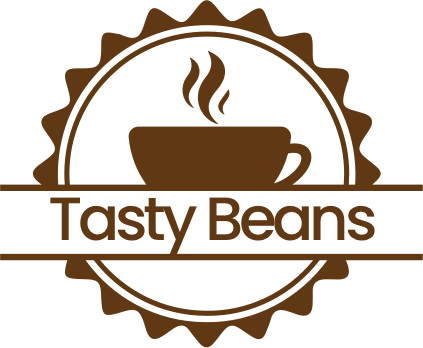

# Event-sourcing and CQRS with Marten

Welcome to the masterclass Event-sourcing and CQRS with Marten. In this workshop, you'll learn how to apply 
event-sourcing and separate write-operations from read-operations using CQRS (Command Query Responsibility Segregation).

This workshop has a couple of exercises that help you understand the essential concepts of event-sourcing and CQRS.

## About the case

This workshop is based on a virtual coffee company called TastyBeans. You can read more about the company below.

------------------------------------------------------------------------------------------------------------------------

Welcome to Tasty Beans, the subscription-based coffee beans shop that makes it easy to get your hands on the best beans
around!

With our recommendations feature, you can easily find the beans that suit your taste, and with our start-up guide, you
can get brewing in no time.

Our selection of beans is based on recommendations from coffee aficionados worldwide. We have the perfect beans
for you, whether you like your coffee light and delicate or dark and bold. Start your subscription today and enjoy
the best coffee beans delivered to your door.

------------------------------------------------------------------------------------------------------------------------

We'll be building the profile service for the TastyBeans solution. This service has the following functional
requirements:

* New customers can register for a subscription
* Existing customers can cancel their subscription
* Customers who canceled before can resubscribe

## About the slides

This workshop comes with a presentation that you'll need to understand the concepts of event-sourcing and CQRS. 
You can find the slides [here](#).

## Exercises

We've made some exercises to get you started building an event-sourced system with Marten.
The first two exercises focus on building a domain and a couple of projections. The final exercise adds another library
called Jasper, which helps you implement command and query handlers to implement CQRS.

1. [Implementing event-sourced entities](./exercises/01-eventsourcing/README.md)
2. [Building read models](./exercises/02-projections/README.md)
3. [Applying CQRS principles](./exercises/03-cqrs/README.md)

You can start from the first exercise and keep expanding your project. Or you can complete one exercise without
completing the other exercises.

## License

This masterclass is licensed under MIT.

## Issues and improvements

Please feel free to submit any issues. We'd also love to see your pull requests with improvements.